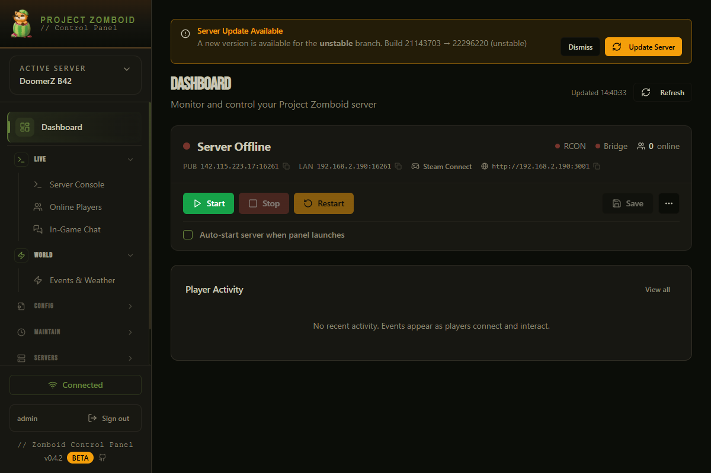

# Zomboid Control Panel

Web-based admin panel for **Project Zomboid dedicated servers on Windows**.
It combines RCON, file tools, backup workflows, multi-server control, and an optional Lua bridge for advanced in-game actions.



## Why this panel

- Manage your server from one UI: start/stop, players, mods, backups, config files, logs, and diagnostics.
- Use **RCON** for standard commands and **PanelBridge** for advanced operations (teleport, weather, character data, and more).
- Run as a standalone `.exe` (no Node.js required) or in dev mode.
- Built specifically for Windows-based PZ hosting workflows.

## Full Feature Overview

### Server Operations
- Start, stop, restart, force-stop, and save world.
- Live server status and runtime monitoring.
- Server update check + one-click update flow.
- Multi-server support with active-server switching.

### Player & Admin Tools
- Online player list, kick/ban/unban/access-level controls.
- Teleport, heal, god mode, invisibility (via PanelBridge).
- Character export/import workflows (skills, perks, recipes, inventory metadata).
- Player notes and historical player activity tracking.

### World, Events, and Chat
- Event triggers (helicopter, horde/noise style triggers).
- Weather and climate controls (rain, storms, fog, temperature, overrides).
- Game time controls and world utilities toggles where supported.
- Global/admin/general chat messaging and chat tooling.

### Mods, Scheduling, and Automation
- Steam Workshop mod tracking and update detection.
- Auto-restart integration for update/maintenance flows.
- Task scheduler for recurring maintenance actions.
- Schedule execution history and visibility.

### Backups and File Management
- Backup create/list/restore/delete flows from panel UI.
- Server file editor for INI/sandbox/spawn-related files.
- Config template/backup safeguards around file operations.
- Chunk cleaner workflow for save cleanup operations.

### Security and Access
- Login + first-run setup experience.
- JWT auth with refresh tokens and remember-me support.
- Hardened endpoint protection, safer input/path handling, and route throttling.
- Auth-aware UI calls and improved session reliability.

### Diagnostics and Observability
- Debug page with service/system health visibility.
- Crash/log viewing and troubleshooting endpoints.
- Real-time log tailing and performance history views.
- Path and environment helpers for setup validation.

### Integrations
- Discord bot integration and config management.
- PanelBridge Lua mod for direct in-game command execution.
- RCON command console for low-latency admin control.

## Quick Start

### Option 1: Standalone Executable (recommended)
1. Run `ZomboidControlPanel.exe`.
2. Complete setup/login flow.
3. Configure server paths + RCON settings.
4. Start managing your server from the panel.

### Option 2: Development Mode
1. Install Node.js 18+.
2. From `Dev1`, run:
   - `npm install`
   - `npm run dev`
3. Open `http://localhost:5173`.

## Launchers

| File | Purpose |
|------|---------|
| `ZomboidControlPanel.exe` | Standalone build (no Node runtime needed) |
| `Start.bat` | Development startup helper |
| `Start-Production.bat` | Production-style startup helper |
| `install.bat` | Dependency installation helper |

## Requirements

### Runtime
- Windows 10/11
- Project Zomboid dedicated server
- RCON enabled in server config

### Development
- Node.js 18+
- npm
- Windows environment

## First-Time Server Setup

1. Open the panel and complete setup/login.
2. Go to **Settings** and configure:
   - Server install path
   - Zomboid data/config path
   - RCON host/port/password
3. Save settings and test connectivity.
4. (Optional but recommended) install PanelBridge for advanced features.

## RCON Configuration

In your server `.ini` (usually in `Zomboid/Server`), set:

```ini
RCONPassword=your_password
RCONPort=27015
```

Restart the server after changes.

## PanelBridge (Optional, Recommended)

PanelBridge unlocks advanced server actions that are not available through base RCON.

### High-value capabilities
- Advanced player controls (teleport/heal/detailed stats).
- Character export/import operations.
- Rich weather/climate/time actions.
- Utility/world state controls and deeper diagnostics.

### Install
1. Copy `pz-mod/PanelBridge` into your server mods directory.
2. Add `PanelBridge` to `Mods=` in server INI.
3. Restart your PZ server.
4. Configure bridge path/settings in panel.

## API/Backend Coverage (Implemented Route Modules)

`auth`, `server`, `players`, `rcon`, `panelBridge`, `mods`, `scheduler`, `backup`, `chunks`, `config`, `discord`, `servers`, `serverFinder`, `serverFiles`, `debug`.

## Main Services (Implemented)

`auth`, `serverManager`, `rcon`, `panelBridge`, `modChecker`, `scheduler`, `backupService`, `discordBot`, `logTailer`, `updateChecker`.

## Environment Notes

Common runtime settings include:

| Key | Purpose |
|-----|---------|
| `PORT` | Panel backend port |
| `RCON_PORT` | PZ RCON port |
| `RCON_PASSWORD` | RCON password |
| `SERVER_PATH` | PZ server installation path |
| `ZOMBOID_DATA_PATH` | Zomboid data folder |
| `MOD_CHECK_INTERVAL` | Mod-check interval |

## Project Structure (Dev Source)

```text
Dev1/
├── client/               # React + TypeScript frontend
├── server/               # Express backend (routes/services/database)
├── pz-mod/PanelBridge/   # Lua bridge mod
├── data/                 # LowDB runtime data
├── logs/                 # Runtime logs
├── build.js              # Build pipeline for client/server/exe
├── deploy*.ps1           # Deployment scripts
└── release.ps1           # Release automation script
```

## Build and Release

- Build executable package: `node build.js`
- Full release pipeline (version bump/build/deploy/sync/release):
  - `./release.ps1 -Version "0.3.0"`

## Troubleshooting

### RCON fails to connect
1. Confirm PZ server is running.
2. Verify `RCONPassword`/`RCONPort` in INI.
3. Ensure firewall allows chosen RCON port.
4. Re-test from panel Settings.

### PanelBridge commands fail
1. Verify `PanelBridge` is enabled in server `Mods=`.
2. Check bridge folder path/config in panel.
3. Restart panel + server after install/config changes.
4. Inspect Debug/log pages for command errors.

### Server start/stop actions fail
1. Verify server path points to folder containing `StartServer64.bat`.
2. Check for stale zombie server processes.
3. Run panel with elevated permissions when required.

### Mod updates not detected
1. Validate workshop IDs in config.
2. Confirm mod tracking list is populated.
3. Check mod checker interval/settings.

## License

MIT License.
