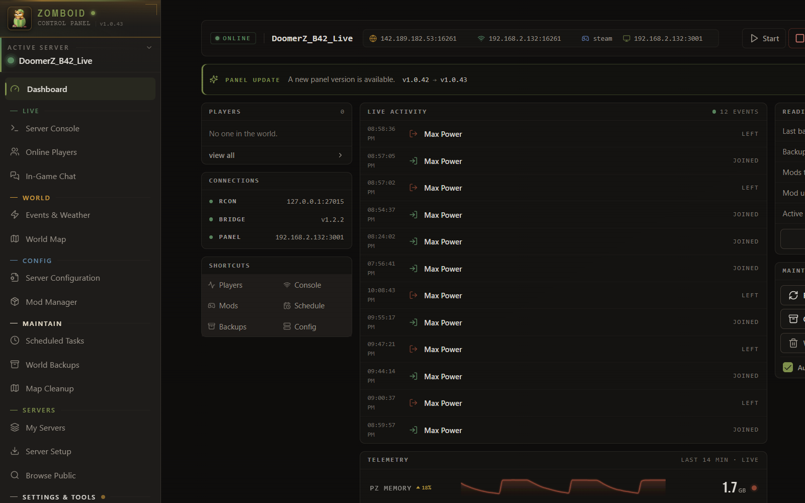
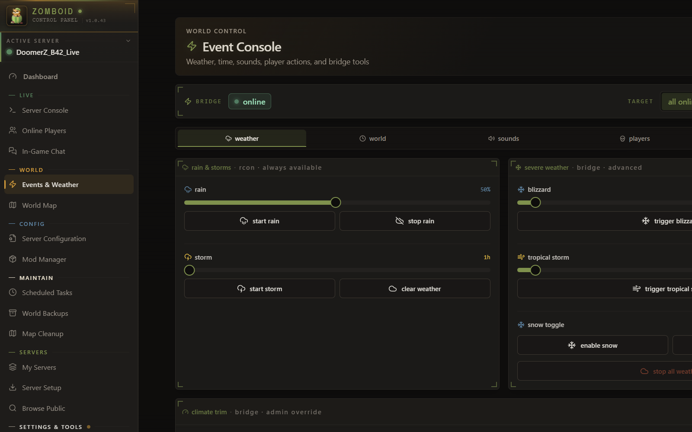
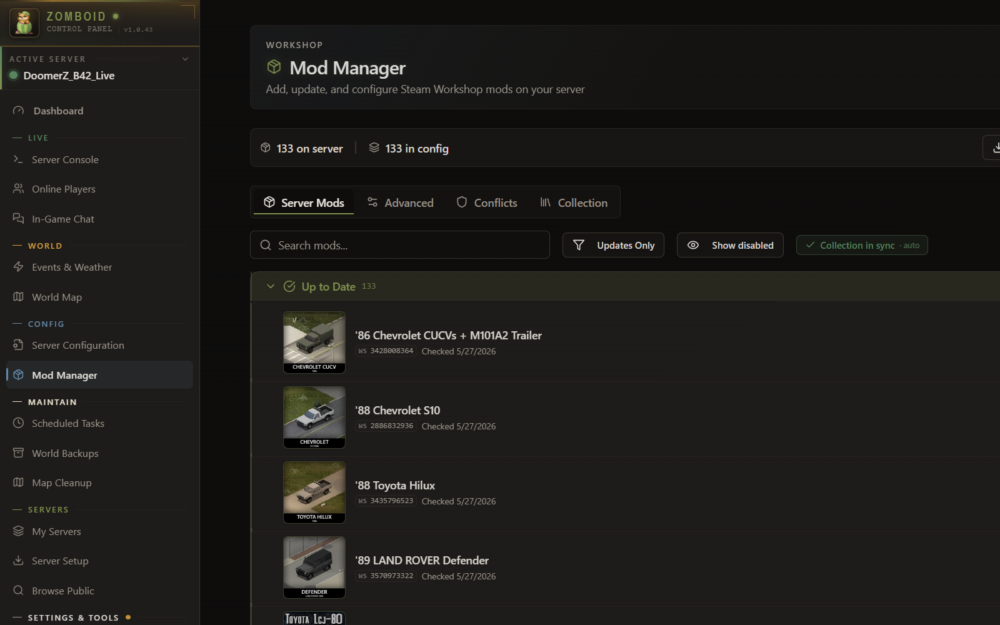
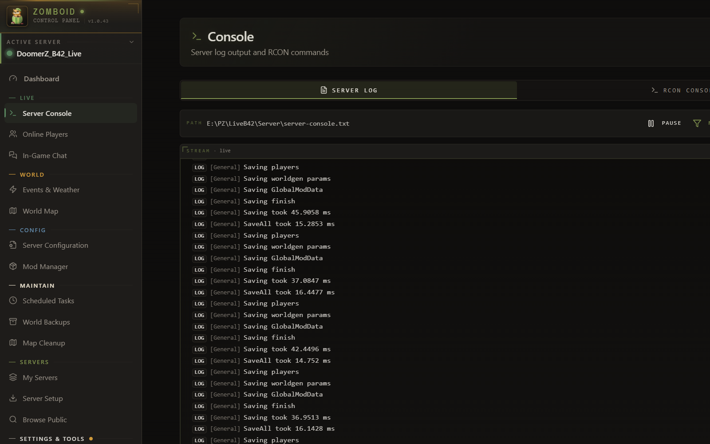
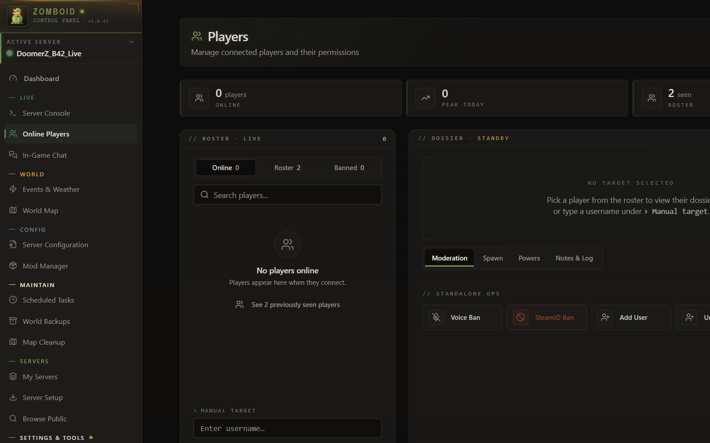
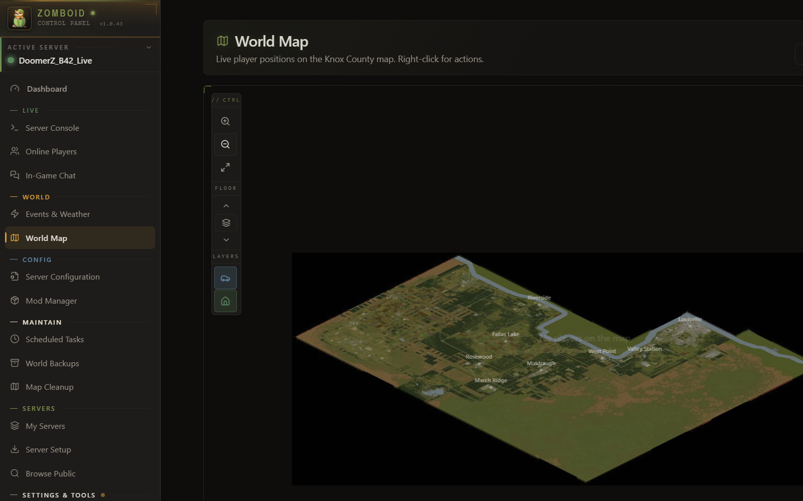
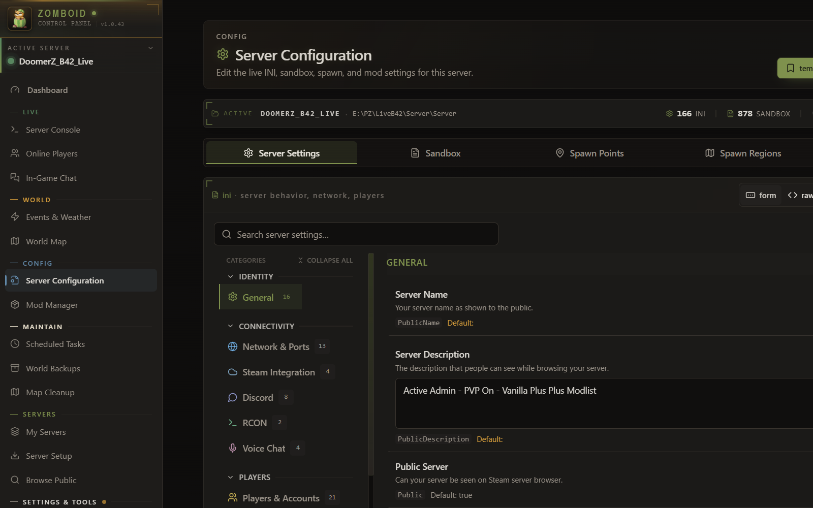
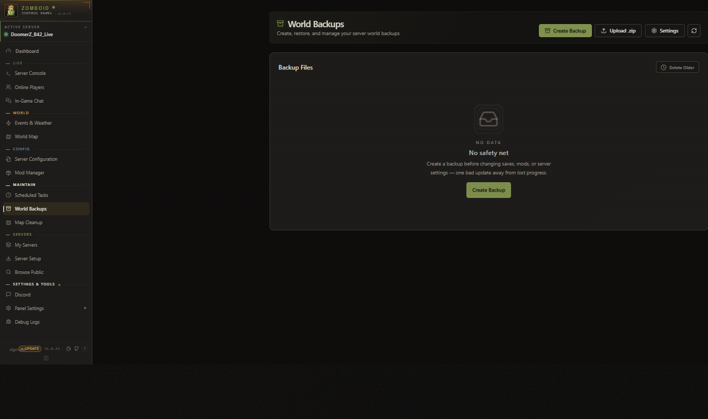

# Zomboid Control Panel

[](https://github.com/fpsacha/zomboid-control-panel/releases/latest)
[](https://github.com/fpsacha/zomboid-control-panel/releases)
[](https://discord.gg/bq4SuyDDZb)
[](LICENSE)

Web-based admin panel for **Project Zomboid dedicated servers**. Runs on Windows, Linux, Docker, or a VPS.

Server control, RCON console, live player map, mod manager, scheduler, backups, Discord bot, and a Lua bridge for actions RCON can't reach — all from one dark-mode control room, instead of juggling five different tools.

**[Live demo →](https://fpsacha.github.io/zomboid-control-panel/)** &nbsp;·&nbsp; **[Discord →](https://discord.gg/bq4SuyDDZb)** &nbsp;·&nbsp; **[Releases →](https://github.com/fpsacha/zomboid-control-panel/releases/latest)**



<p align="center">
   
   
</p>
<p align="center">
   
   
</p>
<p align="center">
   
   
</p>
<p align="center">
   
</p>

No existing PZ server tool covered the full workflow. Most handled one or two parts. So I built the whole thing. [Background story →](https://www.youtube.com/watch?v=P2k0VFX1FUw)

---

## Contents

- [What It Does](#what-it-does)
- [Requirements](#requirements)
- [Quick Start](#quick-start)
- [Setup](#setup)
- [PanelBridge](#panelbridge-optional)
- [Remote Access](#remote-access)
- [Security](#security)
- [Development](#development)
- [Community](#community)

---

## What It Does

### Operate
- **Server control** — Start, stop, restart, save. Live status and uptime.
- **Console** — Live log viewer and RCON terminal with command history.
- **Scheduling** — Recurring restarts, saves, broadcasts with countdown warnings.
- **Backups** — Create, restore, and manage world backups.

### Observe
- **Players** — Online list, activity history, kick/ban/unban, access levels, notes and tags.
- **World map** — Live player positions on Knox County with right-click actions.
- **Mod manager** — Track Workshop mods, detect updates, sync from server config, conflict detection.
- **Server config** — Full INI editor with structured and raw views. Sandbox, spawn points, mod settings — searchable and editable in-browser.

### Extend
- **Events & weather** — Rain, storms, blizzards, climate control, time control, sound triggers, zombie management.
- **PanelBridge** — Server-side Lua mod for actions RCON can't reach: teleport, heal, god mode, character export/import, inventory.
- **Discord bot** — Slash commands and two-way chat relay.
- **Multi-server** — Manage multiple PZ servers from one panel.
- **Chunk cleaner** — Visual map selector for cleaning unused chunks.
- **Auto-update** — Checks for new releases, downloads and applies them.

---

## Requirements

- **Project Zomboid dedicated server** — Build 41 or Build 42. Tested through B42.18.
- **RCON enabled** in your server `.ini` (`RCONPort=27015` and `RCONPassword=...`).
- **Network access** between the panel and the PZ server (same machine, same LAN, or reachable IP).
- For PanelBridge features: `DoLuaChecksum=false` in the server `.ini`.

The packaged binary includes its own runtime — no Node.js, Python, or Java install needed on the panel host.

---

## Quick Start

Download from [Releases](https://github.com/fpsacha/zomboid-control-panel/releases/latest). Self-contained binary — no dependencies.

### Windows
1. Extract `ZomboidControlPanel-windows.zip`
2. Run `Start.bat`
3. Open `http://localhost:3001`

### Linux
```bash
tar xzf ZomboidControlPanel-linux.tar.gz
./start.sh
```
Works on Ubuntu 20.04+, Debian 10+, CentOS Stream 8+, Rocky 8+, or anything with glibc 2.28+.

### Docker

The image runs **the panel only** — Project Zomboid itself still has to run somewhere (on the host, in another container, or on a separate machine). The panel reaches it via RCON and via shared filesystem (for PanelBridge).

Pull the prebuilt image:
```bash
mkdir -p ~/zomboid-panel && cd ~/zomboid-panel
curl -O https://raw.githubusercontent.com/fpsacha/zomboid-control-panel/main/docker-compose.yml
curl -O https://raw.githubusercontent.com/fpsacha/zomboid-control-panel/main/.env.example
mv .env.example .env
docker compose up -d
```
Then open `http://localhost:3001`.

Before bringing it up for real, edit [`docker-compose.yml`](docker-compose.yml) and uncomment the volume mounts that point at your PZ install and `~/Zomboid` folder — the file has two annotated topology examples (PZ on the host vs. PZ on a remote machine). All env vars are documented in [`.env.example`](.env.example).

Prebuilt images are published to GHCR: `ghcr.io/fpsacha/zomboid-panel:latest` and `:vX.Y.Z`. Prefer to build from source? Comment out `image:` in the compose file and uncomment the `build:` block.

---

## Setup

1. Open the panel and create your admin account.
2. In **Settings**, set your server install path and Zomboid data path.
3. Configure RCON (host, port `27015`, password from your server `.ini`).
4. Optionally install PanelBridge for advanced features.

### PanelBridge (Optional)

PanelBridge is a server-side Lua drop-in that enables features RCON can't reach — teleport, heal, weather control, character export/import, inventory editing, sound triggers.

There is no client-side component. Players don't install anything. The panel copies `PanelBridge.lua` into your server's `Install/media/lua/server/` folder, then you set `DoLuaChecksum=false` in the server INI, restart the PZ server, and enable it in **Settings → PanelBridge**.

---

## Remote Access

If you're running the panel on the same machine as your browser, skip this section.

To access the panel from another machine, allow the origin before first launch:

```bash
CORS_ORIGINS=http://YOUR-IP:3001 ./start.sh
```

After login, save it permanently in **Settings → Remote Access** so the env var isn't required next time.

For VPS or public-internet deployment, put the panel behind a reverse proxy (nginx or Caddy) with HTTPS, and set `HTTPS=true` so the panel emits HSTS headers. Don't expose port 3001 directly to the internet.

---

## Security

- JWT authentication on all API routes.
- Rate limiting on login, RCON, and destructive operations.
- RCON parameter sanitization to prevent command injection.
- CORS configurable per deployment (LAN auto-allows private IPs, VPS requires explicit origins).
- Password reset via secure token file or `--reset-password` CLI flag.

---

## Development

```bash
npm run install:all
npm run dev
```
Frontend at `http://localhost:5173`, backend at `http://localhost:3001`.

```bash
node build.js --all        # Build Windows + Linux binaries
npm test                   # Run tests
```

---

## Community

- **Discord** — [discord.gg/bq4SuyDDZb](https://discord.gg/bq4SuyDDZb) for questions, support, and feature ideas.
- **Issues** — [Report bugs or request features](https://github.com/fpsacha/zomboid-control-panel/issues) on GitHub.
- **Changelog** — See the [latest release notes](https://github.com/fpsacha/zomboid-control-panel/releases/latest) for what's new.

---

## License

MIT
