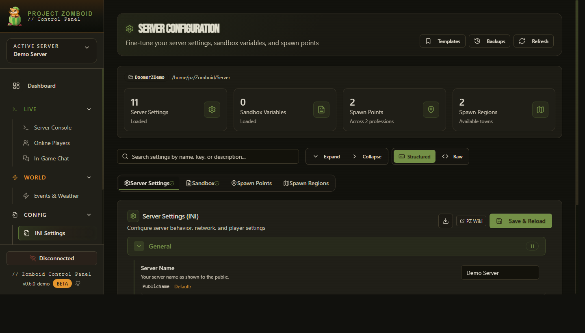

# Zomboid Control Panel

[](https://github.com/fpsacha/zomboid-control-panel/actions/workflows/release-artifacts.yml)
[](https://github.com/fpsacha/zomboid-control-panel/releases/latest)
[](LICENSE)

Web-based admin panel for **Project Zomboid dedicated servers** on **Windows** and **Linux**.

One interface. Everything needed to run your server without jumping between five different tools.

**[Try the live demo →](https://fpsacha.github.io/zomboid-control-panel/)**

> Real UI, real routes, GitHub Pages. Navigation and all pages work. Server actions are intentionally offline — no RCON, no live backend, no writes.

---

## Why

No existing PZ server tool covered the full workflow. Most handled one or two parts. I needed one place for server control, reliable mod update tracking, an in-game bridge, backup management, Discord integration, chunk cleanup, and multi-server support.

So I built the whole thing. [Background story →](https://www.youtube.com/watch?v=P2k0VFX1FUw)

---

<p align="center">
   
   
</p>
<p align="center">
   
   
</p>

---

## Quick Start

### Windows
1. Download `ZomboidControlPanel-windows.zip` from [Releases](https://github.com/fpsacha/zomboid-control-panel/releases/latest).
2. Extract anywhere — keep the folder structure intact.
3. Run `Start.bat`.
4. Open `http://localhost:3001`, complete setup, configure RCON in Settings.

### Linux
1. Download `ZomboidControlPanel-linux.tar.gz` from [Releases](https://github.com/fpsacha/zomboid-control-panel/releases/latest).
2. Extract and run:
   ```bash
   tar xzf ZomboidControlPanel-linux.tar.gz
   ./start.sh
   ```
   Execute permissions are preserved in the archive — no `chmod` needed.
3. Open `http://localhost:3001`.

> On Linux, UI folder browsing requires `zenity` (GNOME) or `kdialog` (KDE). Paths can always be typed manually.

### Docker
```bash
docker build -t zomboid-panel .
docker run -d -p 3001:3001 -v panel-data:/app/data zomboid-panel
```

### Remote Access (VPS)

If you're accessing the panel remotely, run this before first launch to allow your IP:

```bash
echo 'CORS_ORIGINS=http://YOUR_IP:3001' > .env && ./start.sh
```

Once logged in, go to **Settings → CORS / Remote Access** to save it permanently.

### Development Mode
```bash
npm run install:all
npm run dev
```
Frontend at `http://localhost:5173`, backend at `http://localhost:3001`.

---

## Requirements

- Windows 10/11 or Linux (Ubuntu 20.04+, Debian, and similar)
- Project Zomboid dedicated server with RCON enabled

---

## What It Does

### Server Control
Start, stop, restart, force-stop, and save world. Monitor live status and uptime. Manage multiple server profiles.

### Player Management
View online players and activity history. Kick, ban, unban, adjust access levels.

With PanelBridge: teleport, heal, god mode, invisibility, character export/import (skills, perks, recipes, inventory metadata).

### World and Events
Trigger events and weather. Control climate, game time, and sandbox settings. Chat and admin messaging.

### Mods and Scheduling
Track Workshop mods and detect updates. Schedule recurring tasks (restarts, saves, messages).

### Maintenance
Backups and restores, chunk cleanup, and a full RCON command console.

### Integrations
Discord bot configuration. PanelBridge for advanced in-game commands that RCON can't reach.

---

## First-Time Setup

1. Open the panel and complete setup/login on first run.
2. In **Settings**, configure:
   - Server install path
   - Zomboid data/config path (`Zomboid/Server`)
   - RCON host, port (default: `27015`), and password
3. Save and test the connection.
4. Optionally install PanelBridge for advanced controls.

---

## RCON Setup

In your server `.ini` (under `Zomboid/Server`):

```ini
RCONPassword=your_password
RCONPort=27015
```

Restart the server after saving.

---

## PanelBridge Setup (Optional, Recommended)

PanelBridge is a Lua server mod that opens up commands RCON can't reach: character data, detailed weather control, extended world actions. Most of the interesting stuff is behind it.

1. Copy `pz-mod/PanelBridge` to your server mods directory.
2. Add to server INI:
   ```ini
   DoLuaChecksum=false
   ```
3. Restart the PZ server.
4. Set the bridge path in panel Settings.

---

## Release Packages

Each release ships two complete packages (binary + web UI + launch scripts + PanelBridge mod):

| File | Platform | How to run |
|------|----------|------------|
| `ZomboidControlPanel-windows.zip` | Windows | Extract → run `Start.bat` |
| `ZomboidControlPanel-linux.tar.gz` | Linux | Extract → run `./start.sh` |
| `checksums.txt` | Both | SHA256 integrity hashes |
| `release-manifest.json` | Both | Build metadata |

Verify integrity:
```bash
# Linux/macOS
sha256sum -c checksums.txt

# Windows (PowerShell)
Get-FileHash .\ZomboidControlPanel-windows.zip -Algorithm SHA256
```

---

## Build and Release

```bash
node build.js --windows    # Windows exe only
node build.js --linux      # Linux binary only
node build.js --all        # Both platforms + checksums + manifest

npm test                   # Run tests
```

Full release pipeline (PowerShell):
```powershell
.\release.ps1 -Version "0.6.1"
.\release.ps1 -Version "0.6.1" -DryRun       # Preview without changes
.\release.ps1 -Version "0.6.1" -SkipDeploy   # Skip live server deploy
```

---

## Project Structure

```
├── client/               # React + TypeScript frontend
├── server/               # Express backend (routes, services, database)
│   └── tests/            # Vitest tests
├── pz-mod/PanelBridge/   # Lua bridge mod
├── data/                 # LowDB runtime data (never commit db.json)
├── logs/                 # Runtime logs
├── build.js              # Build pipeline
├── Dockerfile
├── deploy*.ps1
└── release.ps1           # Release automation
```

---

## Troubleshooting

**RCON not connecting**
- Confirm the PZ server is running and RCON is enabled in the INI.
- Check firewall rules for the RCON port.
- Re-test from panel Settings after every change.

**PanelBridge commands failing**
- Confirm `DoLuaChecksum=false` and that the server has been restarted.
- Verify the bridge file path in Settings.
- Check the Debug page and server logs for mod errors.

**Server start/stop failing**
- Verify the path points to the correct startup script (`StartServer64.bat` on Windows, `start-server.sh` on Linux).
- Look for stale server processes.

**Mod updates not detected**
- Confirm Workshop IDs are tracked in the Mods page.
- Check the mod checker interval in Settings.

---

## License

MIT
